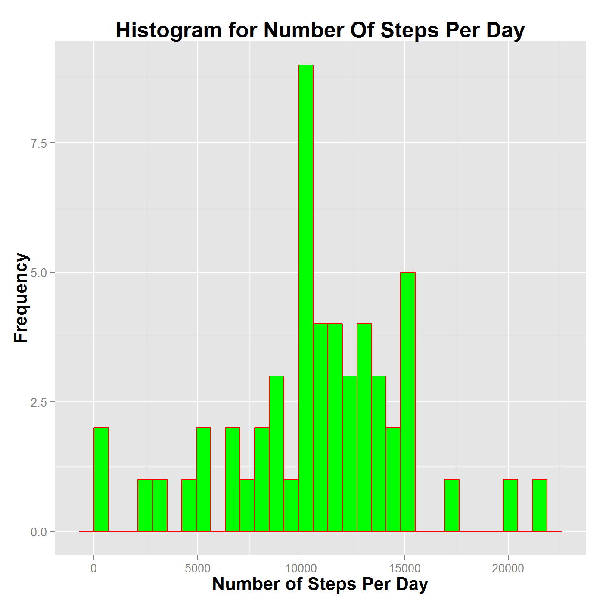
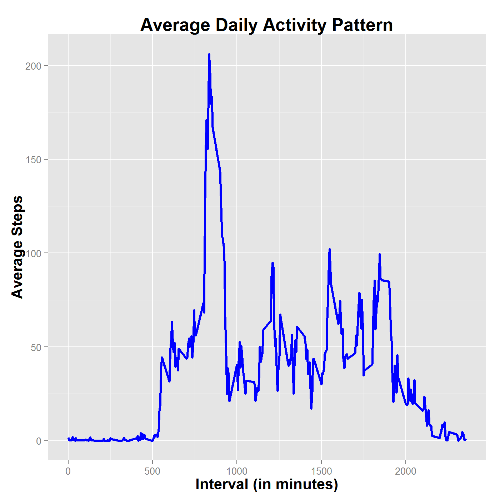
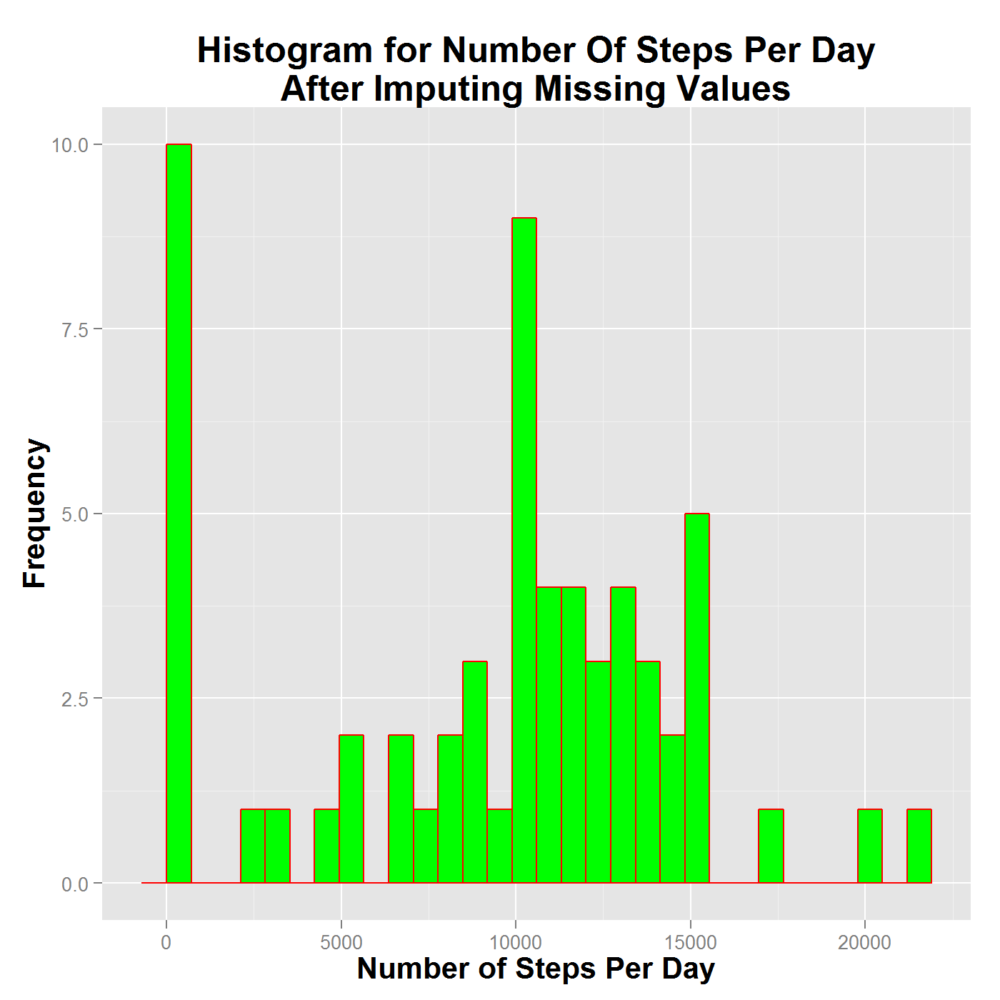
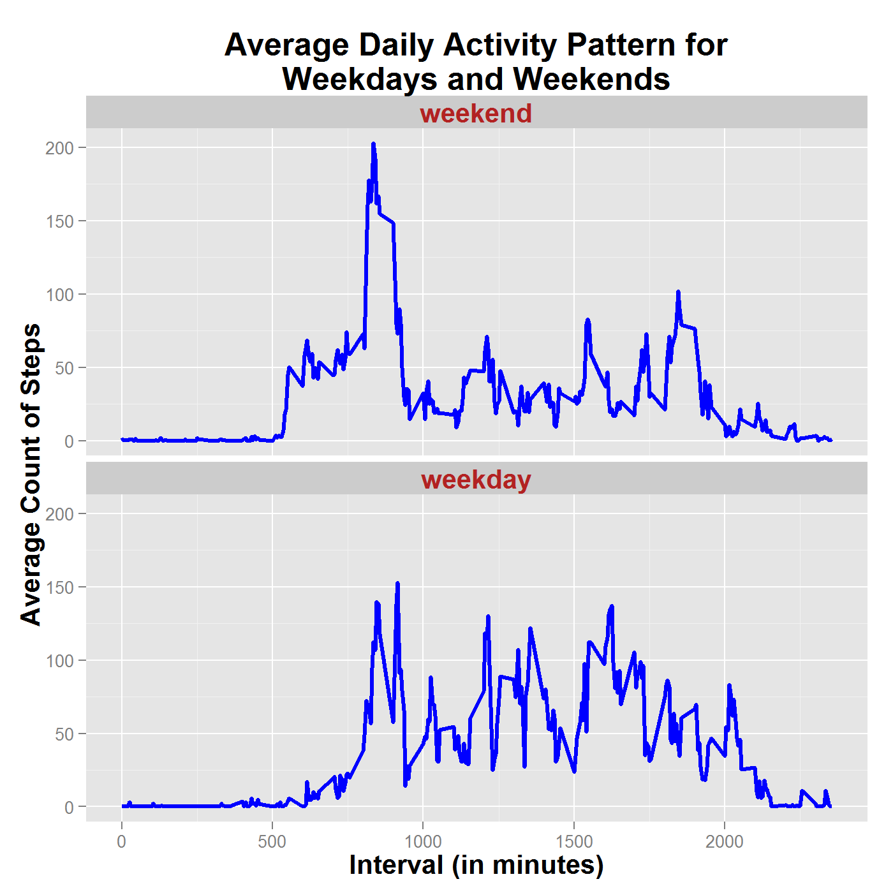

<center> <h1>
**Reproducible Research: Peer Assessment 1**  
============================================  
</h1> </center>  

**Introduction**
--------------

This document provides answers questions from assignment **Peer Assessment 1**  of the **Reproducible Research** course on coursera.org. The dataset for this assignment was collected from a personal activity monitor device worn by an anonymous individual and the zipped file can be downloaded from [here](https://d396qusza40orc.cloudfront.net/repdata%2Fdata%2Factivity.zip).  The dataset consists of the number of steps taken by the individual at 5-minute intervals throughout the day during the months of October and November, 2012. The dataset consists of three variables:

- **`steps`**: Specifies the number of steps taken in a 5-minute interval.
- **`date`**: Specifies the date on which the measurement was taken in YYYY-MM-DD format.
- **`interval`**: Specifies the identifier for the 5-minute interval in which the measurement was taken.

**Loading the required libraries**
--------------------------------

Package `dplyr` is used to to simplify data manipulation on the activity dataset. The data is visualized using package `ggplot2`. If the client doesn't have these packages installed, then the following code chunk will install and load them. Otherwise, the chunk will just load namespaces of both packages and attach them on the search list:


```r
if (!suppressPackageStartupMessages(require(dplyr))){   # if package not loaded
  install.packages("dplyr")                             # install package if required
  suppressPackageStartupMessages(library(dplyr))        # load package
}
if (!suppressPackageStartupMessages(require(ggplot2))){ # if package not loaded
  install.packages("ggplot2")                           # install package if required
  suppressPackageStartupMessages(library(ggplot2))      # load package
}
```

**Setting Global Options for R Chunks**
--------------------------------------

The following code fragment sets global options for R chunks:


```r
knitr::opts_chunk$set(out.height='800px', out.width='800px', dpi=200, echo=TRUE)
```

**Loading the data**
------------------

1. **Load the data (i.e., `read.csv()`).**

If the data file *activity.csv* doesn't exist in the current working directory, then the existing zipped file containing the data file is unarchived. Otherwise, the zipped file is first downloaded and then unarchived. Exploratory data analysis was performed on the data file to determine the format of data for the three columns. The first and third columns specifying variables `steps` and `interval` can be described by the atomic vector class `integer`. The second column specifying variable `date` can be described by the class `Date`.


```r
file_name <- "activity.csv"
if (!file.exists(file_name)) {
	# since data file doesn't exist, check if the zipped file exists ...
	zippedfile_name <- "repdata-data-activity.zip"
	if (!file.exists(zippedfile_name)) {
		# zipped file doesn't exist - download the zipped file ...
		file_url <- "https://d396qusza40orc.cloudfront.net/repdata%2Fdata%2Factivity.zip"
		setInternet2(use=TRUE) # for Windows 8 - otherwise cannot download from https URL's
		download.file(file_url, zippedfile_name)
	}
	# unarchive the file to extract data file ...
	unzip(zippedfile_name)
}
# finally, load the data file
activity_df <- read.csv(file_name,
                        header=TRUE,
                        sep=",",
                        colClasses=c("integer", "Date", "integer"),
                        stringsAsFactors=FALSE
                        )
```

Since there are 288 5-minute intervals in each day and there are a total of 61 days in October and November, we should have 288x61 = 17568 observations in the data frame with 3 variables:


```r
str(activity_df)
```

```
## 'data.frame':	17568 obs. of  3 variables:
##  $ steps   : int  NA NA NA NA NA NA NA NA NA NA ...
##  $ date    : Date, format: "2012-10-01" "2012-10-01" ...
##  $ interval: int  0 5 10 15 20 25 30 35 40 45 ...
```

2. **Process/transform the data (if necessary) into a format suitable for your analysis.**

The argument `colClasses` to function `read.csv()` has been used to specify the class `Date` to the `date` variable when loading the data. And, since package `dplyr` is used to simplify the data analysis, there is no pre-processing required on the data. Instead, the data is processed when required to provide answers for particular questions, 

**What is mean total numbers of steps taken per day?**
----------------------------------------------------

For this part of the assignment, you can ignore the missing values in the dataset.

1. **Make a histogram of the total number of steps taken each day.**

First, days and intervals with missing activity values are removed from the data frame. Using package `dplyr`, the pruned data frame is broken down into groups of observations using the `date` variable. Finally, a summary of the total number of steps is computed for each group of observations:


```r
steps_per_day <- na.omit(activity_df) %>%
                 group_by(date) %>%
                 summarise(totalSteps = sum(steps))
```

A histogram of the total number of steps per day is plotted using package `ggplot2`:


```r
ggplot(data=steps_per_day, aes(x=totalSteps)) +
geom_histogram(binwidth=diff(range(steps_per_day$totalSteps))/30,
              col="red",
              fill="green"
              ) +
labs(title="Histogram for Number Of Steps Per Day") +
labs(x="Number of Steps Per Day") +
labs(y="Frequency") +
theme(plot.title = element_text(face="bold",size=rel(1.50))) +
theme(axis.title = element_text(face="bold", size=rel(1.25)))
```



2. **Calculate and report the mean and median total number of steps taken per day.**

The mean and median are computed:


```r
steps_mean <- mean(steps_per_day$totalSteps)
steps_median <- median(steps_per_day$totalSteps)
```

The mean and median of the total number of steps taken per day are **10766.19** and **10765**, respectively.

**What is the average daily activity pattern?**
---------------------------------------------

1. **Make a time series plot (i.e., ) of the 5-minute interval (x-axis) and the average number of steps taken, averaged across all days (y-axis).**

Using package `dplyr`, the data frame `activity_df` is broken down into 288 groups of observations using the `interval` variable. There are 288 groups since each day is divided into 5-minute intervals. For each group, the average number of steps within that group are computed.


```r
steps_per_interval <- activity_df %>%
                      group_by(interval) %>%
                      summarise(avg_steps=mean(steps, na.rm=TRUE))
```

Using package `ggplot2`, a time-series plot of the 5-minute interval versus the average number of steps taken is generated:


```r
ggplot(steps_per_interval, aes(x=interval, y=avg_steps)) +
geom_line(col="blue", lwd=1.05) +
labs(title="Average Daily Activity Pattern") +
labs(x="Interval (in minutes)") +
labs(y="Average Steps") +
theme(plot.title = element_text(face="bold",size=rel(1.5))) +
theme(axis.title = element_text(face="bold", size=rel(1.25)))
```



2. **Which 5-minute interval, on average across all the days in the dataset, contains the maximum number of steps?**

The word **average** in the question has caused confusion in understanding the question. This has led me to interpret the question in two ways. The first interpretation is: "I break down the data frame `activity_df` into 288 groups of observations using the `interval` variable. I summarize each of the 288 groups based on the maximum number of steps. Out of these 288 summaries, I report the `interval` variable for the observation containing the maximum number of steps."


```r
maxsteps_per_interval <- activity_df %>%
                          group_by(interval) %>%
                          summarise(max_steps=max(steps, na.rm=TRUE))

# now, find which observation has the maximum number of steps
obs_idx <- which.max(maxsteps_per_interval$max_steps)
# report the variable interval for this observation
max_step_interval <- maxsteps_per_interval$interval[obs_idx]
```

The 5-minute interval containing the maximum number of steps is: **615**.

The second interpretation is: "I break down the data frame `activity_df` into 288 groups of observations using the `interval` variable. I summarize each of the 288 groups based on the average number of steps. Out of these 288 summaries, I report the `interval` variable for the observation containing the maximum average number of steps."


```r
# the summary based on average number of steps has been computed while answering question 1

# now, find which observation has the maximum value for the average number of steps
obs_idx <- which.max(steps_per_interval$avg_steps)
# report the interval variable for this observation
max_step_interval <- steps_per_interval$interval[obs_idx]
```

The 5-minute interval containing the maximum number of steps is: **835** as can be seen from the time-series plot of average number of steps taken.

I feel that the first interpretation is more valid and useful since an interval having the maximum average number of steps need not have the maximum number of steps. For example, the mean value of a vector `c(1:10)` is higher than the mean value of the vector `c(rep(0,9),20)`. However, the largest value `20` is contained in the second vector.

**Imputting missing values**
--------------------------

Note that there are a number of days/intervals where there are missing values (coded as `NA`). The presence of missing days may introduce bias into some calculations or summaries of the data.

1. **Calculate and report the total number of missing values in the dataset (i.e., the total number of rows with `NA`s).**

The following code chunk computes the total number of rows with `NA`s:


```r
num_of_rows_nas <- sum(is.na(activity_df))
num_of_steps_nas <- sum(is.na(activity_df$steps))
```

The number of rows in the data frame `activity_df` with `NA`s is: **2304** while the number of elements in variable `steps` with `NA`s is: **2304**. It is confirmed that all the missing values in data frame `activity_df` are in variable `steps`.

2. **Devise a strategy for filling in all of the missing values in the dataset. The strategy does not need to be sophisticated. For example, you could use the mean/median for that day, or the mean for that 5-minute interval, etc.**

The strategy used in this analysis is to replace missing values in variable `steps` with the statistical **mode** of steps taken at the same interval (across all days). Using package `dplyr`, the data frame `activity_df` is broken down into 288 groups of observations with variable `interval` serving as the grouping parameter. For each group of observations, the mode of variable `steps` is computed. That is, within each group, the most frequently occurring value for variable `steps` is determined. In the data frame `activity_df`, the missing value in variable `steps` for a particular observation is replaced with the mode at the same interval.

3. **Create a new dataset that is equal to the original dataset but with the missing data filled in.**

Since, base R doesn't define a function to compute the mode of a set of numbers, the following function is implemented:


```r
Mode <- function(x) {
  # extract unique elements in number set x
  ux <- unique(x)
  
  # match: find positions (in ux) of matches of original vector in unique vector
  # tabulate: count how many times positions (in ux) have been reported by match
  # which.max: find index (in vector returned by tabulate) of most matches of x in ux
  # find value in ux that is most frequently occurring
  ux[which.max(tabulate(match(x,ux)))]
}
```

Using package `dplyr`, data frame `activity_df` is broken down into 288 groups of 5-minute intervals and for each group, the mode of variable `steps` is computed:


```r
mode_per_interval <- activity_df %>%
                      group_by(interval) %>%
                      summarise(mode_steps = Mode(steps))
```

Data frame `activity_new` is a copy of data frame `activity_df`. The missing values in variable `steps` are replaced with the appropriate mode of steps taken for the same 5-minute interval:


```r
# make copy of original activity dataset
activity_new <- activity_df
# indices of all elements in steps that have missing values
na_idx <- which(is.na(activity_new$steps))
# for each missing value index in variable steps:
# use index to get variable interval identifier in same observation
# use this identifier to access appropriate mode value
int_idx <- sapply(activity_new$interval[na_idx],
                  function(x) { which(mode_per_interval$interval == x)})
activity_new$steps[na_idx] <- mode_per_interval$mode_steps[int_idx]

# check if there are any further missing values in data frame
na_cnt <- sum(is.na(activity_new))
```

There are **0** missing values in the new dataset.

4. **Perform analysis on the new dataset.**
  + **Make a histogram of the total number of steps taken each day.**
    
  A summary of the total number of steps taken each day is computed for the new data frame and a histogram of the total number of steps per day is plotted:


```r
newsteps_per_day <- na.omit(activity_new) %>%
                    group_by(date) %>%
                    summarise(totalSteps = sum(steps))

ggplot(data=newsteps_per_day, aes(x=totalSteps)) +
geom_histogram(binwidth=diff(range(newsteps_per_day$totalSteps))/30,
              col="red",
              fill="green") +
labs(title="Histogram for Number Of Steps Per Day\nAfter Imputing Missing Values") +
labs(x="Number of Steps Per Day") +
labs(y="Frequency") +
theme(plot.title = element_text(face="bold",size=rel(1.5))) +
theme(axis.title = element_text(face="bold", size=rel(1.25)))
```



  + **Calculate and report the mean and median total number of steps taken per day.**
  
  The mean and median are computed:


```r
newsteps_mean <- mean(newsteps_per_day$totalSteps)
newsteps_median <- median(newsteps_per_day$totalSteps)
```

The mean and median of the total number of steps taken per day in the new data frame `activity_new` are **9354.23** and **10395**, respectively.

  + **Do these values differ from the estimates from the first part of the assignment?**
  
  The mean and median of the total number of steps taken per day in the old data frame `activity_df` are **10766.19** and **10765**, respectively. Thus, the mean has changed considerably from **10766.19** to **9354.23**. The change in the median from **10765** to **10395** is less drastic.
  
  + **What is the impact of imputing missing data on the estimates of the total daily number of steps?**
  
  The impact of imputing missing data is determined to a large extent by the technique used to compute the missing values. I chose to use the mode of the variable `steps` for a particular 5-minute interval. From the second histogram, it is clear that the mode of variable `steps` for most 5-minute intervals is `0`. This means that the total number of steps has not changed after imputing missing values. However, the number of intervals has increased leading to the mean of the total number of steps taken per day to decrease considerably. On the other hand, the median has not changed drastically because many of the observations had recorded `0` for variable `steps` and replacing missing values with `0` cannot affect the median.
  
5. **Are there differences in activity patterns between weekdays and weekends?**

Use the dataset with the filled-in missing values for this part.

  + **Create a new factor variable in the dataset with two levels: "weekday" and "weekend" indicating whether a given date is a weekday or weeknend day.**
  
  The following code uses the `mutate` verb in package `dplyr` to add a new factor variable `day` that is a function of an existing variable `date` and the internal structure of the data frame is displayed to check if the new factor variable `day` is added correctly:
  

```r
activity_new <- mutate(activity_new,
                      day=factor((weekdays(date)%in%c("Saturday","Sunday")),
                                 levels=c(FALSE,TRUE), labels=c("weekend","weekday"))
                       )

str(activity_new)
```

```
## 'data.frame':	17568 obs. of  4 variables:
##  $ steps   : int  0 0 0 0 0 0 0 0 0 0 ...
##  $ date    : Date, format: "2012-10-01" "2012-10-01" ...
##  $ interval: int  0 5 10 15 20 25 30 35 40 45 ...
##  $ day     : Factor w/ 2 levels "weekend","weekday": 1 1 1 1 1 1 1 1 1 1 ...
```

  + **Make a panel plot containing a time series plot (i.e., `type = "l"`) of the 5-minute interval (x-axis) and the average number of steps taken, averaged across all `weekday` days or `weekend` days (y-axis).**
  
  The following code uses package `ggplot2` to generate a faceted time-series plot to display the activity pattern for weekdays and weekends:
  

```r
steps_per_day <- activity_new %>%
  group_by(day, interval) %>%
  summarise(avg_steps=mean(steps, na.rm=TRUE))

ggplot(steps_per_day, aes(x=interval, y=avg_steps)) +
  geom_line(col="blue", lwd=1.05) +
  facet_wrap( ~day, ncol=1) +
  labs(title="Average Daily Activity Pattern for\nWeekdays and Weekends") +
  labs(x="Interval (in minutes)") +
  labs(y="Average Count of Steps") +
  theme(plot.title = element_text(face="bold",size=rel(1.5))) +
  theme(axis.title = element_text(face="bold", size=rel(1.25))) +
  theme(strip.text = element_text(face="bold",size=rel(1.25), colour="firebrick"))
```



